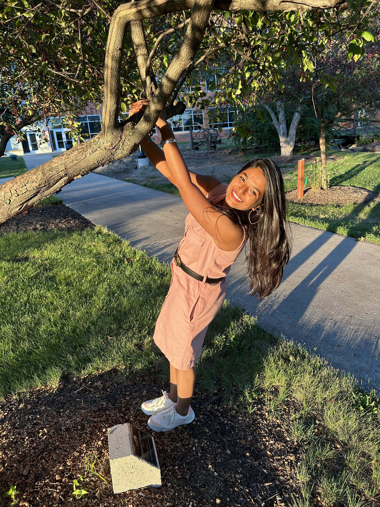

# Nikhila Mateti

This Nikhila Mateti, well interesting facts me are that I love to cook, dance, Sing and i love to spend time with my family and friends. I learn things easily.

# My favorite Sports

Below table describes the games that I alaways show interest to play such as Tennis, Badminton, Volley Ball, Ping pong 

| Sports | Reasons to recommend | weekly Hours spent|
|:---: | :--- | :---:|
|Tennis | Tennis offers a combination of physical activity, mental stimulation, social interaction, and competitive excitement that resonates with a wide range of people, making it a beloved sport around the world. | 5~7 hrs|
|Badminton| I like badminton because it offers a fun and accessible way to stay physically active, fosters social interaction, provides mental stimulation through strategy, can be played indoors or outdoors| 8 hrs|
|Volley Ball|I like volleyball because it's a team-oriented sport that promotes physical activity, communication, and cooperation.Volleyball also offers a fast-paced, exciting game that's both fun to play and watch.|3 hrs|
|Ping Pong| It's easy to set up and play, making it accessible to people of all ages. Ping pong can be enjoyed both recreationally and competitively, providing a fun way to stay active and improve hand-eye coordination.| 5 hrs|
